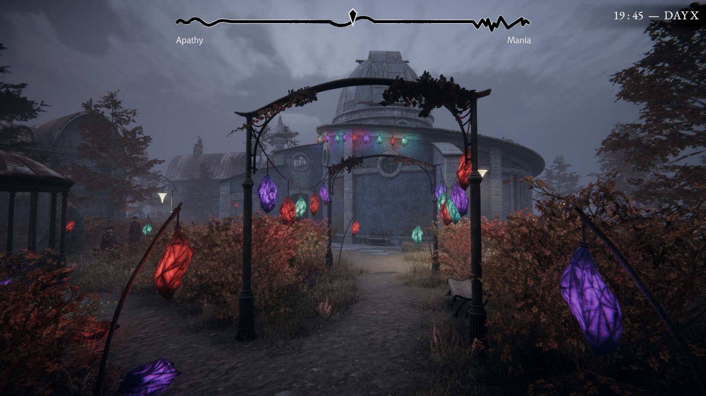

---

### Adrian Adrović  
**Software Engineering Student**

I am an engineering student with a strong interest in backend systems, data integrity, and structured problem-solving. Outside of software, I am deeply engaged in gaming, mountaineering, history, and martial arts. I value discipline, consistency, and systems that remain reliable under real pressure.

I am particularly motivated by environments that demand clarity, accountability, and long-term thinking. I enjoy building things that last, understanding how systems fail, and improving them until they do not.

---

## Focus & Technical Direction

### Backend & Data
- Backend Development  
- Database Engineering  
- API Design  
- System Architecture  
- Data Modeling and Integrity  

---

## Technologies & Tools

### Languages

### Databases

### Web

### Game Development

### Networking & Systems

### Code Editors

---

## Gaming Systems & Environments

**Steam:** Adrian - 277361066

**PlayStation:** Adrian12Lara3 

### Games of Interest
- Resident Evil  
- Metro  
- The Elder Scrolls  
- The Witcher  
- Pathologic  
- Fallout  
...
  
---

## Contact

atko.adrovic@gmail.com
atko.github@gmail.com

generalatko 

+382 67 708 468
